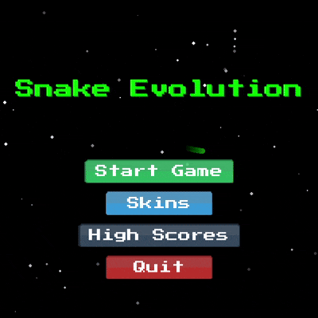

# Modern Snake Game

A modern implementation of the classic Snake game with additional features and beautiful visuals. The game includes multiple game modes, obstacles, portals, and a high score system.



## Features

- 🎮 Multiple game modes with different obstacles and challenges
- 🎨 Beautiful UI with animated menu backgrounds
- 🏆 High score system with medal rankings
- 🎯 Grid-based movement with perfect alignment
- 🌈 Visual effects and animations
- 🎵 Sound effects and background music
- 🔄 Border wrapping (snake can pass through edges)
- 🎪 Strategic portal placements
- 🏁 Three obstacle patterns: symmetric, corners, and diagonal

## Installation

1. Clone the repository:
```bash
git clone https://github.com/zahdineamine2003/Snake-gamein.python.git
cd Snake-gamein.python
```

2. Create a virtual environment (recommended):
```bash
python -m venv venv
source venv/bin/activate  # On Windows: venv\Scripts\activate
```

3. Install dependencies:
```bash
pip install -r requirements.txt
```

4. Download game assets (this will download required images and sounds):
```bash
python download_assets.py
python download_sounds.py
```

## How to Play

1. Run the game:
```bash
python game.py
```

2. Use arrow keys or WASD to control the snake
3. Collect food to grow and increase your score
4. Avoid obstacles and your own tail
5. Use portals for strategic movement
6. Try to achieve the highest score!

## Game Controls

- Arrow Keys / WASD: Move snake
- ESC: Pause game
- Enter: Select menu option
- Up/Down: Navigate menu

## Project Structure

- `game.py`: Main game loop and initialization
- `menu.py`: Menu system and UI
- `snake.py`: Snake logic and movement
- `map.py`: Map generation and obstacles
- `config.py`: Game configuration and constants
- `assets/`: Game assets (images, sounds)
- `generate_sounds.py`: Sound generation utilities
- `download_assets.py`: Asset downloader
- `download_sounds.py`: Sound downloader

## Contributing

Contributions are welcome! Please feel free to submit a Pull Request.

## License

This project is licensed under the MIT License - see the LICENSE file for details.

## 📬 Contact

**Email:** [zahdineamine23@gmail.com](mailto:zahdineamine23@gmail.com)
**GitHub:** [zahdineamine2003](https://github.com/zahdineamine2003)
